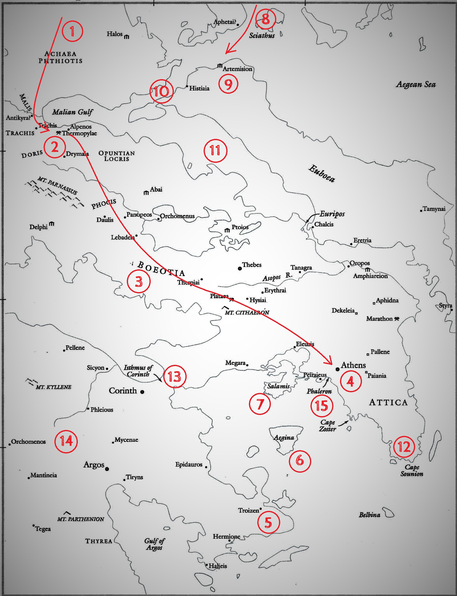
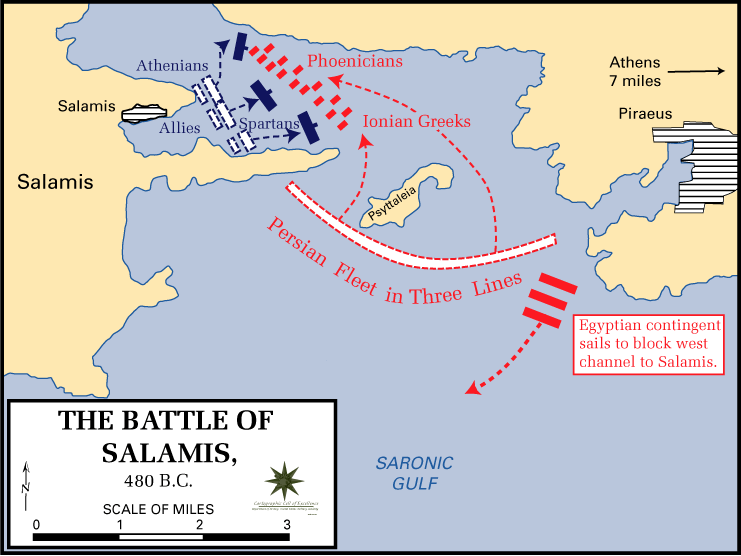
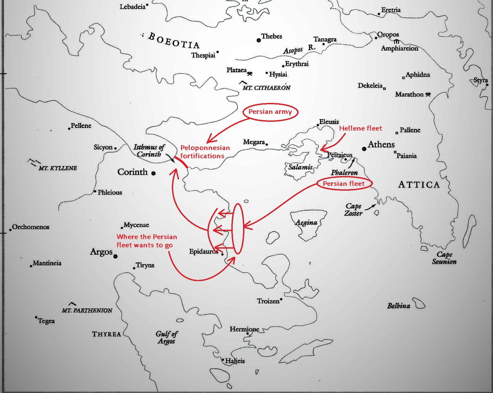
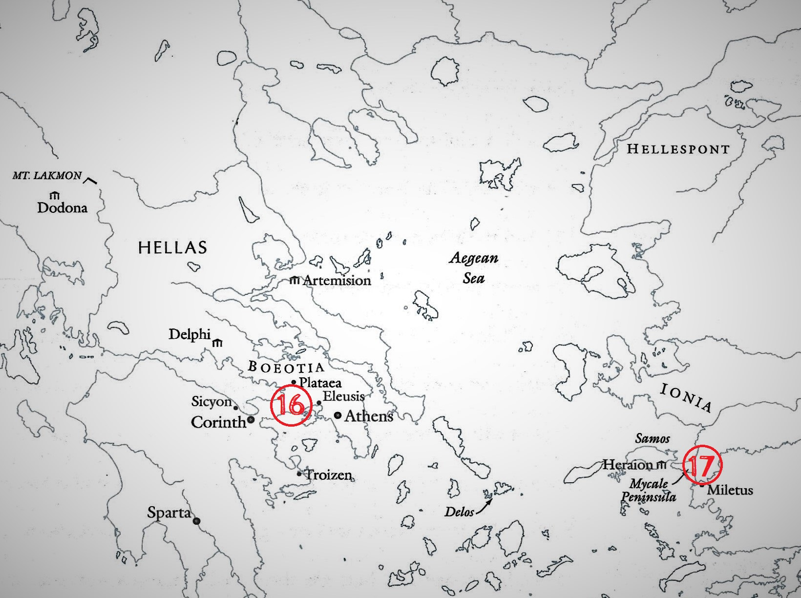

Ever since reading Herodotus' *[Histories](https://www.amazon.com/Landmark-Herodotus-Histories-Robert-Strassler/dp/1400031141)*, I've been wondering off and on about the Battle of Salamis. It's just never made much sense to me why Xerxes would attack the Hellene fleet in the way he did, so I thought I'd do a little armchair generaling, second guess his decision, and explain why it doesn't make any sense given the strategic situation. I might end up making this armchair general thing a series on this blog if I come across any more military decisions that don't make sense in my reading. My [Online Great Books](https://onlinegreatbooks.com/) seminar has Plutarch coming up soon and will be reading about Julius Caesar's Gallic Wars later, so there might be ample opportunity for that.

For now, let's lay out the strategic situation in 480 BC leading up to Salamis.

### The Strategic Situation

A massive Persian army under the Great King Xerxes invaded Hellas by land from the north. Xerxes' father Darius had attempted an invasion in 490 BC, but was defeated by an Athenian-led Hellenic force at Marathon, thwarting his effort to conquer and subjugate the Hellenes. Xerxes hoped to avenge this defeat and succeed where his father had failed.

The Persian army marched through Thessaly unopposed (1) until they were met by a small Spartan-led force at the pass of Thermopylae (2). The Spartans and their allies held the pass for three days, but were eventually surrounded and wiped out after the Persians discovered a hidden path around their flank. Most of you will probably be familiar with those events from the 2006 documentary *300* starring Gerard Butler. After the defeat of the Spartans, the Persians marched unopposed through Boeotia (3) towards Athens (4), ravaging the country as they went, then sacked and burned Athens. The Athenian people survived by packing up all the belongings they could move, boarding their ships, and sailing to Troizen (5), Aegina (6), or Salamis (7) before the arrival of the Persians.

Meanwhile, an equally massive Persian fleet was sailing down the eastern coast of Hellas (8) in support of the land army. It fought an inconclusive sea battle with an allied Hellene fleet off Artemision (9), suffering high casualties both from the fighting and from a storm. The objective of the Hellene fleet was to protect the flank of the Spartan force at Thermopylae and prevent their encirclement, so the fleet withdrew upon hearing news of the defeat at Thermopylae since there was no longer any reason to hold the straits of Artemisium (10) and Euboea (11). The Hellene fleet withdrew around Cape Sounion (12) to a position in the strait between Athens and the nearby island of Salamis, while the Persian fleet received reinforcements and was brought up to near its former strength.

The next objective for Xerxes was to advance his land army across the Isthmus of Corinth (13) and into the Peloponnese (14) to complete his conquest of Hellas. The Peloponnesians, led by the Spartans, were in the process of building fortifications across the narrow isthmus to oppose the army's advance, but these fortifications would be rendered useless if the Persian fleet could simply sail around them and land troops in the Peloponnesian rear. This was to be the fleet's objective, and the only thing standing in its way was the much smaller Hellene fleet stationed at Salamis.

Athenian general Themistokles would be the man responsible for organizing the fleet action to defend the coast and prevent the encirclement of the Peloponnesian land forces by sea. If successful, the Persians would be forced to march their land army into the narrow confines of the isthmus where their vastly superior numbers could not be used to great effect, a situation similar to that at the pass of Thermopylae, but against greater numbers of Hellenes with better-fortified defensive positions and with no possible routes available for flanking. If Themistokles failed, the Persians could simply use their massive fleet to land a force on the Peloponnesian mainland, encircle the defenders on the isthmus, and recreate the Battle of Thermopylae on a larger scale.

### The Battle

In keeping with the general theme of using confined spaces to negate Persian numerical superiority, Themistokles kept the Hellene fleet in the narrow confines of the Strait of Salamis and waited for the Persians to attack. The other Hellene commanders apparently weren't too keen on this strategy, so Themistokles pulled some masterful subterfuge to force the issue of a battle in the straits, using a secret message to Xerxes himself to induce the Persians to send a detachment around the island of Salamis to the western end of the strait, cutting off the Hellenes' retreat before sending the main fleet in from the east to destroy them.

By some estimates, the Persian ships outnumbered the Hellenes by a margin of 2-1 or even 3-1. They advanced into the strait at dawn in three ranks, which became disordered as they squeezed into the narrow space. The Hellenes maintained their two orderly ranks in a stationary position in the strait, possibly using a feigned flight by the Corinthian contingent to convince the enemy that their fleet cohesion was disintegrating and draw them in more recklessly. When the moment was right, the Hellenes struck the Persian front rank fast and hard, blunting the advance. As the second and third ranks of Persian ships continued the advance, they ran up on rammed wrecks and retreating ships from the first rank, and with no room to maneuver in the narrow strait, ran afoul of each other and caused further disorder and confusion. The Persian numerical superiority turned into a disadvantage, exactly as Themistokles had intended.

By the end of the day, the Persians had suffered many times the losses of the Hellenes. The survivors retreated back to Phaleron (15), and the threat of encirclement to the defenders on the isthmus was negated for good. Where the Persian fleet had previously outnumbered the Hellenes by a large margin, the balance was now roughly equal after their heavy losses, if not slightly tipped in favor of the Hellenes. The Hellenes would now have much freer reign of the waters between Attica and the Peloponnese and could meet the Persians with equal or greater strength if they tried to land troops in the Peloponnese, without needing to use a confined space like the Strait of Salamis to negate a numerical disadvantage.

### Xerxes' Decision

My contention is that Xerxes had no compelling strategic reason to even fight this battle in the first place. Let's take another look at the strategic situation pre-Salamis:

As we've said before, the strategic objective for the Persian fleet is to support the land army by landing troops somewhere in the Peloponnese on the other side of the defensive positions on the isthmus. We also know that Themistokles wants to force a battle in a narrow confined space to mitigate the Persian numerical advantage. If the Hellenes were to be drawn out into open water, the extra maneuvering space would allow the Persians to use their numbers to much greater effect and the Hellene fleet would be done for. We can see clearly from the map that in their position in the Strait of Salamis, the Hellene fleet is NOT blocking the Persians' route to where they want to go.

Why doesn't Xerxes just bypass the Hellene fleet completely? There are two main possibilities if he does:

1. The Hellenes are forced to come out and fight in open water to prevent troops from landing in the Peloponnese, in which case they get destroyed as explained above.
2. The Hellenes stay where they are and the Persian fleet gets to land their troops, which was their objective the whole time.

The Persian fleet is large enough that if he wanted to, Xerxes could even leave a detachment to keep the Hellenes penned up in the strait while the rest of his fleet lands troops in the Peloponnese. There is no good reason for him to stake the entire campaign on one decisive naval battle. One of his top naval commanders, queen Artemisia of Halicarnassus (Herodotus' hometown), even points this out to him:

> If you do not rush into waging a sea battle, but instead wait and keep your ships near land, or even if you advance to the Peloponnese, then, my lord, you will easily achieve what you intended by coming here. The Hellenes are incapable of holding out against you for very long; you will scatter them, and each one will flee to his own city.

— Artemisia, *The Histories* 8.68.β.1-2

Xerxes has nothing to gain and everything to lose from this battle, and he ends up losing. So why did he fight the battle? I've brought this question up in two OGB seminars now, and the best answer we've been able to come up with has been hubris. Xerxes has assembled the largest and most impressive army and navy thus far seen in the world, and it might as well be invincible as far as he's concerned. Maybe the possibility of defeat never even crossed his mind, or maybe he was worried about appearing weak to both the enemy and his subjects if he avoided a decisive sea battle. Maybe he just thought it would be easy and convenient to get rid of the Hellene fleet up front, before any combined land and sea operations, and not have to worry about them again.

Whatever his reasoning was, I have to imagine that hubris played a part. Hubris, meaning an extreme pride, overconfidence, or unawareness of one's own human weakness, shows up all over ancient Greek literature, especially in the tragic plays. Aeschylus, who fought at Salamis, explored this theme directly in the person of Xerxes in his tragedy *The Persians*, produced in Athens eight years after the battle in 472 BC. The play takes place in the Persian capital city of Susa upon Xerxes' return after the defeat at Salamis and features the ghost of Xerxes' father Darius dressing him down for his hubris.

Whatever Xerxes' state of mind may have been, the defeat at Salamis seems to have broken his spirit somewhat. Although the Persians still had a large numerical advantage on land, the Peloponnesians had their strong defensive positions on the isthmus, and without a way of flanking them there would be little hope of a breakthrough. Besides that, Xerxes had intended to complete the conquest in one campaigning season because maintaining such a large force in the field for long periods of time would have been a next to impossible task. The campaigning season of 480 was now drawing to a close, and any hope of breaking through the Peloponnesian defenses before winter was certainly gone. With all this in mind, Xerxes departed the way he came to march back to Persia with most of his army, leaving his general Mardonios with a relatively small detachment to winter in Boeotia and continue ravaging Boeotia and Attica the following summer. The campaign wasn't over completely after Salamis, but Xerxes himself seems to have lost the motivation to continue.

In the summer of 479 BC, an allied Hellene land army advanced across the isthmus from the Peloponnese and back into Boeotia and met Mardonios' force near the town of Plataea (16), winning a resounding victory, all but wiping out the Persians, and marking the end of any Persian hopes of permanent conquest. Meanwhile, the remnants of the Persian fleet retreated across the Aegean Sea to Mycale (17), soon pursued by the Hellene fleet. Unwilling to fight another sea battle, the Persians beached their ships and established a fortified camp on shore, but the Hellenes also landed on shore and destroyed the camp as well as the ships and the Persians themselves.

So I don't have a good answer for why Xerxes attacked the Hellenes at Salamis other than hubris. If you can think of a good reason, or if you think I'm wrong and it was actually a good move to fight the battle given what Xerxes knew at the time, I'd love to hear about it in the comments.
