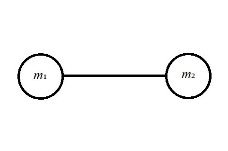
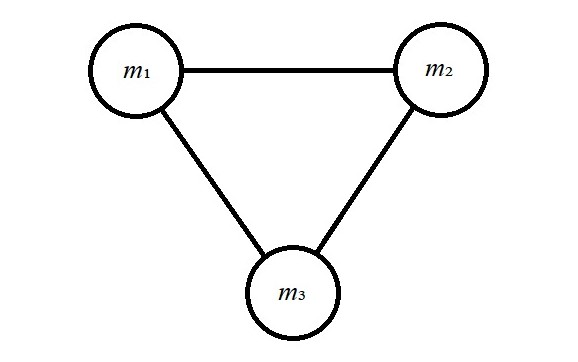
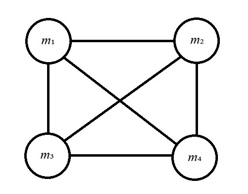
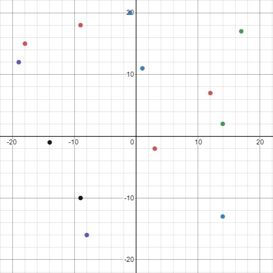
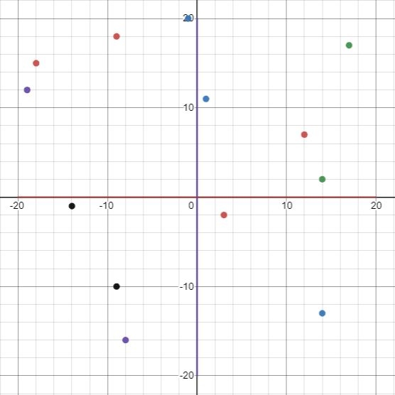
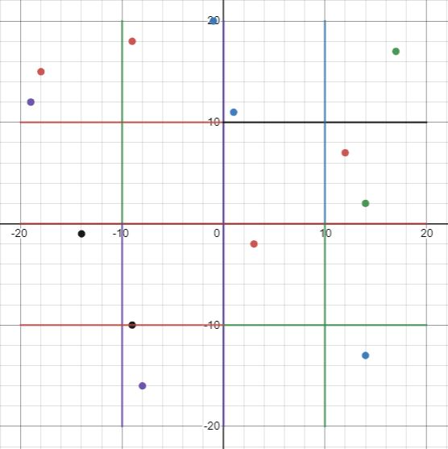
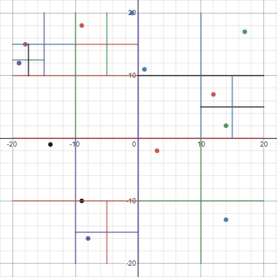
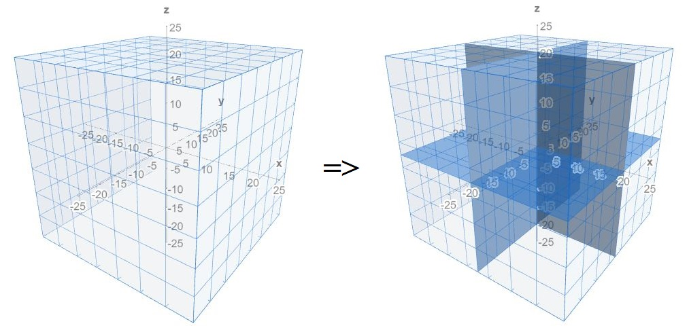

This will be an explanation of something I learned while building my [Solar System Explorer](https://solar-system-simulator.herokuapp.com/) project. Before we find out what the Barnes-Hut algorithm is, let's first explain why it's useful by going over how n-body simulation works.

When building something like my Solar System Explorer that attempts to simulate real gravitational interactions of objects in space, it is necessary to calculate gravitational forces between objects. The simplest way to do this is to represent the objects in the simulation as point masses and use Newton's law of universal gravitation to calculate the forces. While not the most accurate method possible as it doesn't take into account any non-homogeneous distribution of mass within an object or any relativistic effects, it's plenty accurate for non-scientific purposes and makes the calculations easy. Newton's law of universal gravitation takes the form


where ```𝐺``` is the gravitational constant (approximately 6.674x10⁻¹¹ m³kg⁻¹s⁻²), ```𝑚₁``` and ```𝑚₂``` are the masses of two objects, ```𝑟``` is the distance between the objects, and ```𝐹``` is the calculated gravitational force between the objects.

The brute force method for simulating the motions of objects based on this law can be described as follows:

> 1. Start with initial positions and velocities for each object in the simulation.
> 2. For a single object, use Newton's law to calculate the gravitational influence of every other object.
> 3. Sum the gravitational influence of every other object to get a total force acting on the current object.
> 4. Calculate the current object's acceleration, ```𝑎 = 𝐹/𝑚``` where ```𝐹``` is the calculated total force from step 3 and ```𝑚``` is the object's mass.
> 5. For a given time step ```𝑡```, calculate the current object's new velocity, ```𝑣 = 𝑣₀ + 𝑎𝑡``` where ```𝑣₀``` is the current velocity and ```𝑎``` is the calculated acceleration from step 4.
> 6. For the same time step ```𝑡```, calculate the current object's new position, ```𝑠 = 𝑠₀ + 𝑣𝑡``` where ```𝑠₀``` is the current position and ```𝑣``` is the calculated velocity from step 5.
> 7. Repeat steps 2-6 for every object in the simulation.
> 8. Update the positions and velocities of every object in the simulation to their calculated values from steps 5 and 6.
> 9. Using the new positions and velocities, start over with step 1 and continue with the next time step.
> 10. Repeat for as long as the simulation continues.

This is the most accurate method possible without using more complicated math and physics, but it is slow; its time complexity is *O*(*n*²). In a two-body simulation there is only one pair of objects, so there is only one gravitational force calculation necessary for each time step:



In a three-body simulation three force calculations are needed for each time step:



For four bodies the number of force calculations per time step is six:



Continuing in this manner, the following table shows the number of force calculations needed for *n* bodies:

| ***n*** | **Force calculations needed** |
| :---: | :---: |
| 2 | 1 |
| 3 | 3 |
| 4 | 6 |
| 5 | 10 |
| 6 | 15 |
| 7 | 21 |
| 8 | 28 |
| 9 | 36 |
| 10 | 45 |
| 11 | 55 |
| 12 | 66 |

The number of calculations needed will continue to increase with the sequence of [triangular numbers](https://en.wikipedia.org/wiki/Triangular_number) and will grow large fairly quickly. My particular project has 223 total objects available for simulation (the Sun plus all of the known planets, dwarf planets, and moons in [NASA's JPL Horizons database](https://ssd.jpl.nasa.gov/?horizons)), which leads to 24,753 force calculations needed for each time step. For simulations with even more objects, such as galaxy-level simulations or solar system simulations which include many thousands of asteroids, comets, and other small bodies, it will quickly become impossible for a typical computer to perform all of the necessary calculations in a reasonable amount of time.

This is where the Barnes-Hut algorithm comes in. Developed by astrophysicists Josh Barnes and Piet Hut, the algorithm solves this issue by taking advantage of the fact that we can approximate gravitational forces by treating far-away groups of bodies as single point masses. For example, when calculating the gravitational influence of Saturn and its 82 known moons on the Earth, we would need to make 83 force calculations using the brute force method. The Barnes-Hut algorithm allows us to treat the entire Saturnian system as a single object whose mass is the total mass of Saturn and all of its moons, located at the barycenter of the Saturnian system. This will reduce the number of calculations from 83 to one and will yield an approximation of the influence of the entire system which will be very close to the actual value due to the vast distance between the Earth and the Saturnian system. We can similarly approximate any group of bodies that is sufficiently far away from the current body in question, greatly reducing the number of force calculations needed and yielding a reduced time complexity of *O*(*n* log *n*).

This approximation has to be done in a way that doesn't simply reduce each planetary system to a single point mass, however. In the example above, this reduction would not work for calculating the forces acting on an object *within* the Saturnian system; for that we would still need to sum the influences of many objects. Additionally, the algorithm needs to be flexible enough to allow for the possibility of moons being flung out of their current orbits. The Barnes-Hut algorithm accomplishes this not by simply treating each planetary system separately, but by recursively dividing the simulation space into separate regions.

Let's take the following set of objects as an example, where each point represents the location of a solar system object with its own mass:



We first divide the simulation space into four quadrants:



Next, we divide each quadrant into four subquadrants:



We continue dividing each subquadrant until each division contains either 0 or 1 objects:



The space is now divided into regions where each region has a defined size and either is empty, contains one object, or is further divided into more subregions. For example, the region defined by ```10 < 𝑥 ≤ 20, -10 < 𝑦 ≤ 0``` is empty and has a size of 10 units, the region defined by ```10 < 𝑥 ≤ 15, 5 < 𝑦 ≤ 10``` contains one object located at ```(12, 7)``` and has a size of 5 units, and the region defined by ```0 < 𝑥 ≤ 20, 0 < 𝑦 ≤ 20``` contains four objects, has a size of 20 units, and is further subdivided into more regions.

In a software implementation, this space will be represented as a tree data structure where each node of the tree represents a region in the space. The root node of the tree represents the entire space, and its quadrants will be represented as the child nodes, and so on for the rest of the subregions. Each node stores the upper and lower limits of the region, the region's size, total mass, and center of mass, and any subregions the region may have. Empty regions will have a mass of zero and an undefined center of mass. Regions containing one object will have a mass the same as the object's mass and a center of mass at the same location as the object's location. Regions containing multiple objects have a mass equal to the sum of the mass of all contained objects, and a center of mass calculated by a [weighted average of the locations of all contained objects](https://en.wikipedia.org/wiki/Center_of_mass#A_system_of_particles).

When we use this structure to calculate the total force acting on a single object, we first select a threshold value ```𝜃```. The purpose of this value will become clear in a moment, but for now, increasing the value of ```𝜃``` leads to a less accurate but faster algorithm, and decreasing the value of ```𝜃``` leads to a more accurate but slower algorithm. For a value of ```𝜃 = 0```, the algorithm behaves the same as the brute force method of calculation. Rather than summing the gravitational influences of all other objects on the current object, we sum the gravitational influences of each quadrant of the region on the current object.

If a region is empty, it has no gravitational influence and we can simply ignore it. If a region contains only one object, we can simply calculate its gravitational pull based on the location and mass of that object. For regions containing multiple objects, we calculate the quotient ```𝑠/𝑑```, where ```𝑠``` is the size of the region in question, and ```𝑑``` is the distance from the current object to the region's center of mass. If ```𝑠/𝑑 < 𝜃```, the region is considered sufficiently far away from the current object to be reducible to a single point mass, and we calculate the region's gravitational influence on the current object based on its total mass and center of mass, as if it were a single object. If ```𝑠/𝑑 ≥ 𝜃```, the region is considered too close to the current object to be reducible, and we calculate its gravitational pull by summing the forces of its four subquadrants, recursively continuing down the tree for each subquadrant until we find regions that either are empty, contain only one object, or are sufficiently far away from the current object that ```𝑠/𝑑 < 𝜃```.

The above example was shown in two dimensions for the sake of visual simplicity, but for the Solar System Explorer I implemented this algorithm in the three-dimensional space of the solar system. The only difference is that instead of a two-dimensional space being recursively divided into quadrants, the three-dimensional space is recursively divided into octants as shown below. The overall concept is the same. You can see my three-dimensional implementation [on GitHub](https://github.com/jmcginty15/Solar-system-simulator).



The tree (quadtree in two dimensions, or octree in three dimensions) must be rebuilt for each time step of the simulation since objects change position after each time step and may have shifted between regions, possibly changing the regions' total masses and centers of mass as well as the distributions of subregions. Because of the computational overhead involved in building the quadtree or octree, the Barnes-Hut method will not tend to produce significant improvements in speed over the brute force method until the number of objects becomes very large, and for very small numbers of objects the brute force method will almost certainly be faster.

It turns out that for my particular project, this algorithm was totally unnecessary since 223 objects isn't enough to make the Barnes-Hut method faster than the brute force method. However, I still found the experience valuable for the sake of thinking through and learning how to implement an algorithm like this, and if I ever want to add onto the project, by adding many thousands of asteroids and comets into the simulation for example, or if I ever want to build something like a galactic level simulation with millions or billions of stars, I'll already have knowledge of a valuable tool to use.
