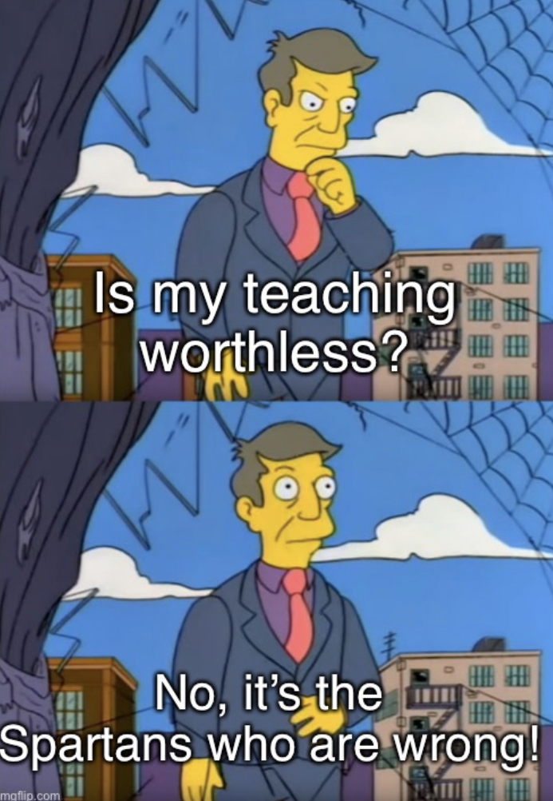

In Plato's *Greater Hippias*\*, Socrates converses with the titular Hippias about the definition of "fine" — an English translation of the Greek word *kalon*, "a widely applicable term of highly favorable evaluation, covering our 'beautiful' (in physical, aesthetic, and moral senses), 'noble', 'admirable', 'excellent', and the like" according to John M. Cooper's introduction in Hackett's [Plato: Complete Works](https://www.amazon.com/Plato-Complete-Works/dp/0872203492).

Before we get to that conversation though, we are treated to Troll Socrates at his finest. He gives us a nice little proof that the teachings of the sophists are not beneficial. The high and mighty Hippias spends a page or so expounding on his great ability to teach virtue and wisdom and all other important subjects. He makes good money in this line of work, and chalks up his high earnings to his great wisdom and the value of his teachings. Socrates asks, "Tell me this: from which of the cities you visit did you make the most money? From Sparta, obviously, where you visited most often." (283b)

Hippias says he did not make the most money from Sparta; in fact he never made a single obol from Sparta. "That's weird, Hippias, and amazing!" (283c) says Socrates. If Hippias' teachings are so beneficial, why wouldn't the Spartans want to pay for his wisdom? Do they not want to become better, more virtuous, and more wise? Do they lack the money to pay? Are they better at educating their own sons than Hippias would be?

None of these are the reason, says Hippias. The real reason he never made any money from the Spartans is that "foreign education is not lawful for them." (284c) But this only brings up another problem for Socrates.

> SOCRATES: But look here. Don't lawmakers make law to be the greatest good to the city? Without that, the law-abiding civilized life is impossible.\
> HIPPIAS: True.\
> SOCRATES: So when people who are trying to make laws fail to make them good, they have failed to make them lawful—indeed, to make them law. What do you say?

— *Greater Hippias* 284d

Law that is not beneficial to the city that enacts it is not true law. We'll come back to this in a minute, but for now just keep in mind that Hippias agrees with it. With all this information, we have a neat little proof, at least to Hippias, that Hippias' teachings are not beneficial.

1. Spartan law forbids Hippias from teaching their youth because Hippias is a foreigner.
2. Laws are beneficial to a city; those that aren't are not lawful.
3. If a law forbids beneficial teaching, it is not beneficial and therefore not lawful.
4. But Spartan law forbids Hippias' teaching, which must mean either that Spartans are not a law-abiding people, or that Hippias' teaching is not beneficial.

But every Greek knows that Spartans are not only law-abiding, but the *most* law-abiding people known. We might dispute whether the Spartans are actually the most law-abiding people in the world, but the important thing here is that *Hippias* believes that they are.

> SOCRATES: But Sparta really is law-abiding.\
> HIPPIAS: Of course.\
> SOCRATES: And what's most highly prized in law-abiding cities is virtue.\
> HIPPIAS: Of course.\
> SOCRATES: And you, you know most finely of men how to pass virtue on to other people.\
> HIPPIAS: Very much so, Socrates.

— *Greater Hippias* 283e-284a

Another quibble we might have with this proof is with the idea that laws are by definition beneficial to the city that enacts them. We might say that governments enact laws all the time that are meant to benefit their cities, but fail to do so. Socrates says that if the laws fail to benefit the city, they are by definition not true laws. He asks Hippias what he thinks about this:

> HIPPIAS: In precise speech, Socrates, that is so. But men are not accustomed to use words in that manner.\
> SOCRATES: Do you mean those who know, Hippias, or those who don't?\
> HIPPIAS: Ordinary people.\
> SOCRATES: Are *they* the ones who know the truth—ordinary people?\
> HIPPIAS: Of course not.\
> SOCRATES: But I suppose people who know, at least, believe that what is more beneficial is more lawful in truth for all men. Do you agree?\
> HIPPIAS: Yes, I grant that it's that way in truth.

— *Greater Hippias* 284e

Like a true sophist, Hippias tries to argue with the definition saying that regular people don't usually define "law" the way Socrates does, then admits that he himself agrees with Socrates' definition. Again, it only matters here that Socrates and Hippias agree that the lawful is by definition beneficial. By this definition, any so-called law that does not benefit the city that enacts it is not actually lawful.

After this demonstration, Hippias logically *cannot* go on believing all of the following ideas: 1) Sparta is a law-abiding city, 2) laws are by definition beneficial, and 3) the teachings of Hippias are beneficial. He *must* drop at least one of these beliefs to remain consistent. So Hippias drops his belief in the value of his teachings, reforms his ways, stops being a sophist and making money off of ignorant midwits, and takes up a life of philosophy.

Just kidding. Of course that's not what happens.

> SOCRATES: By your account it is more lawful for the sons of the Spartans to be educated by Hippias and less lawful by their fathers, if they will really be more benefited by you.\
> HIPPIAS: They certainly will be benefited, Socrates.\
> SOCRATES: Then the Spartans are breaking the law by not giving you money and entrusting their sons to you.\
> HIPPIAS: I grant that. I think you said your say on my behalf, and there's no need for me to oppose it.\
> SOCRATES: So we find the Spartans to be lawbreakers, and that on the most important issue, though they appear to be most lawful.

— *Greater Hippias* 285b-c

"You're right, Socrates," Hippias says, "the Spartans *should* give me money!" (slightly paraphrased by me) Hippias' ability to extract money from people by professing his teachings of virtue and wisdom is what has made him rich. Giving up his belief in the value of his teachings would be a major shakeup to his entire world. He would have to admit to himself that he has made a lot of money by providing an illusion of value instead of actual value. So instead he pulls a Principal Skinner.

There's no reflection from Hippias on the implications of this contradiction. He doesn't really even show any hostility towards Socrates for exposing the contradiction. He simply wants to move past it as fast as possible and get on to making money with his sophistic teaching. Then Socrates brings up an argument he had with a hypothetical interlocutor (really himself), saying the man pointed out Socrates' ignorance of what the "fine" is when Socrates was critiquing parts of a speech as "fine" and other parts as "foul". (286c)

Proceeding in a similar manner to how he does in *Euthyphro*, Socrates says he wants to learn what the "fine" is so he can go back to the man, give an answer, and not be refuted. Hippias, of course, has all the answers and says it will be the simplest thing in the world to teach Socrates what the "fine" is. After a couple of weak definitions from Hippias that Socrates easily picks apart, it becomes clear that Hippias is in no way interested in actually investigating what the "fine" is, or even clearly expressing something he already knows to Socrates. He has no respect for Socrates' interlocutor and doesn't pick up on the fact that the interlocutor is really Socrates himself.

> The man's quite simple; he has no feeling at all for fine possessions. If you answer him that this thing he's asking for, the fine, is just *gold*, he'll be stuck and won't try to refute you.

— Hippias, *Greater Hippias* 289e

Hippias just wants to shut the man up and go on maintaining his self-image as an eminently wise teacher who has answers for everything. Socrates does eventually get some better answers out of him, but it's like pulling teeth. Hippias isn't doing philosophy, he's playing a manipulation game.

The rest of the sophists are playing the same game as Hippias, but that's a topic for another day. I think we can apply this to our own conversations with people. It's important to know what game is being played. You can't play the Searching for Truth game with a person who is playing the Dominate and Manipulate game, except *maybe* if you're Socrates (you're not, and neither am I). It's hard even for Socrates, and he never seems to get to any final answers with these people, in *Greater Hippias* or in any other dialogue where he talks to sophists. He finishes the dialogue this way:

> Hippias, my friend, you're a lucky man, because you know which activities a man should practice, and you've practiced them too—successfully, as you say. But I'm apparently held back by my crazy luck. I wander around and I'm always getting stuck. If I make a display of how stuck I am to you wise men, I get mud-spattered by your speeches when I display it. You all say what you just said, that I am spending my time on things that are silly and small and worthless. But when I'm convinced by you and say what you say, that it's much the most excellent thing to be able to present a speech well and finely, and get things done in court or any other gathering, I hear every insult from that man (among others around here) who has always been refuting me. He happens to be a close relative of mine, and he lives in the same house. So when I go home to my own place and he hears me saying those things, he asks if I'm not ashamed that I dare discuss fine activities when I've been so plainly refuted about the fine, and it's clear I don't even know at all what *that* is itself! "Look," he'll say. "How will you know whose speech—or any other action—is finely presented or not, when you are ignorant of the fine? And when you're in a state like that, do you think it's any better for you to live than die?" That's what I get, as I said. Insults and blame from you, insults from him. But I suppose it is necessary to bear all that. It wouldn't be strange if it were good for me. I actually think, Hippias, that associating with both of you has done me good. The proverb says, "What's fine is hard"—I think I know *that*.

— Socrates, *Greater Hippias* 304b-e

\* *I'm aware that scholars don't agree on whether Plato actually wrote* Greater Hippias *or whether someone else wrote it. I'm no scholar, but I have read a fair bit of Plato at this point and I think I agree just because Hippias comes off as a little cartoonishly douchey in this one, much more so than Socrates' sophist interlocutors in other dialogues, and there's almost a bigger focus on that than on actually finding a definition of "fine". I don't really care though, I'll just read it and leave that question to the fart sniffers to figure out.*
