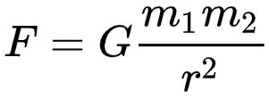

---
date: 2022-12-31
title: Faith and the Assumption of Constants
published: true
tags: ['Philosophy', 'Christianity', 'Aristotle', 'Prior Analytics', 'Posterior Analytics', 'Metaphysics', 'Logic', 'Great Books']
series: true
cover_image: ./images/sunrise.jpg
canonical_url: false
description: How everything ultimately rests on faith. Trust me, it's not stupid.
filename: 'faith-assumption-of-constants'
---

_Preamble: This is my first time writing on this blog about anything related to religious doctrine or beliefs, so I'll put my cards on the table. I am a **brand new** Orthodox Christian and I don't know anything, so it's more than likely I'll say something wrong here. If I do, I'll gladly accept correction from any clergy (or just people who know more than me) who might happen to read this and notice something I got wrong. With that out of the way, this one has been burning a hole in my head for a while now, so let's go._

### The Farmer and the Sun

I'd like to take you on a little journey. A journey through time and space, back to Bronze Age Greece circa 2000 BC. We meet a humble farmer named Achilles. Not the one from the _Iliad_; this Achilles is like a seventh cousin or something of that Achilles. He's much less famous and much less warlike. He makes his living working the land, hoping to store up a big enough harvest to get him and his family through the next winter, and that the nearest warlord doesn't call up all the men to go try to sack the next town over.

Achilles' livelihood (and the livelihoods of everyone in his corner of Hellas and for that matter the entire known world) depends on something we still take for granted today and barely even think about: the rising and setting of the sun. Every day the sun shines down on the crops and makes them grow. Achilles wakes up before dawn to tend his livestock and fields all day while there's light to see by. He takes a break near midday when the sun is hottest to cool off in the stream. When the sun goes down in the evening and it gets dark, he goes back to his house to shelter from the cold and the unknown terrors of the night, looking forward to the next morning's sunrise when he'll wake up and do it all over again.

One morning, the sun doesn't rise. Nobody knows why; it just doesn't. Achilles' life is thrown into chaos. The cycle he's known since he first opened his eyes as a baby has been broken. How will he tend the fields when he doesn't have light to see by? How will the crops grow without the light and heat they need? Will the sun ever rise again? How long will it be before it does? Achilles can only speculate, but the problem is clear: a constant he has depended on his entire life to _stay_ constant (the day/night cycle) has ceased to be a constant.

Of course this is a fictional story. In reality Achilles goes through his whole life without the day/night cycle ever being interrupted, but the point is he depends on this completely. If it _were_ to be interrupted, the consequences would be earth-shattering (maybe literally). This is also where faith comes in. Achilles doesn't know how planets and their orbits work, or any other mechanics of _why_ and _how_ the sun rises every morning. In fact, he has no way of being absolutely certain that it _will_ rise again tomorrow; all he knows is that it _has_ risen every morning since he's been alive. Let's take a brief digression into the world of logic to explain why he can't be certain of the next sunrise.

### Deduction and Induction

Deduction, or deductive reasoning, is a process by which a _necessary_ conclusion can be drawn from certain assumed premises. As Aristotle states it in _Prior Analytics_:

> A deduction is a discourse in which, certain things being stated, something other than what is stated follows of necessity from their being so.

— Aristotle, *Prior Analytics* 1.24b.19-20

The classic example of a deduction is the following:

1. All men are mortal. (premise)
2. Socrates is a man. (premise)
3. Therefore Socrates is mortal. (conclusion)

If both the premises are true, the conclusion _must_ be true. It's a dead certainty. No further assumptions outside the argument's own premises need to be made in order to guarantee the truth of the conclusion. The key to a deduction is that if we're to learn anything actually true about the world, we need to have some way of guaranteeing the truth of the premises from which the conclusion is derived. So the premises must be either things we can observe directly, or things we've already demonstrated through previous deductions. But if we can be certain that our premises are true, and we can make a valid and sound syllogism, we can be _absolutely certain_ of the conclusion derived from such a deduction.[^¹]

If anyone knows where Aristotle explicitly defines induction in the way he does deduction, please let me know because I haven't been able to find it. But he does say this:

> All teaching and intellectual learning come about from already existing knowledge. This is evident if we consider it in every case; for the mathematical sciences are acquired in this fashion, and so is each of the other arts. And similarly too with arguments—both deductive and inductive arguments proceed in this way; for both produce their teaching through what we are already aware of, the former getting their premisses as from men who grasp them, **the latter proving the universal through the particular's being clear.**

— Aristotle, *Posterior Analytics* I.1.71a1-9

Notice that the deduction example above started with the universal and proved something about the particular. Premise 1 made a universal, categorical statement about a class (men), premise 2 identified one particular thing (Socrates) as a member of that class, and the conclusion made a statement about the particular thing, made necessary by his membership in the class. The deduction proceeds from universal to particular.

Aristotle's comments here state that induction goes the opposite way, proceeding from particular to universal. If we want to _induce_ something universal, we make many observations about many particular cases, and infer that if something holds true for all the cases we've observed, it will hold true universally. If we're Achilles the farmer, we might say something like this:

1. The sun has risen every morning since I've been alive. (premise)
2. Therefore, the sun will rise every morning in the future. (conclusion)

The premise makes a statement about many particular cases where we've observed the sun to rise, and the conclusion states that this observation applies to *every* case universally. Induction proceeds from the particular to the universal.

### The Hidden Assumption, or the Constant

Unlike deduction, induction does not give us certainty. This is because of a hidden assumption that we cannot possibly be certain of. The hidden assumption is that if we make the same observation about many particulars and never observe something contrary to it, that observation will be true universally of the class. We have to assume that the thing we've observed many times is, in fact, a constant.

In Achilles' case, he utterly depends on the day/night cycle to be a constant. His entire life is based on the assumption that the sun will rise again tomorrow, and continue to rise every day at least as long as he's on the earth. Since he doesn't know anything about orbital mechanics, there's no *deduction* he can make that will demonstrate with certainty that this assumption is true. The best he can do is *induction*, which we've seen is necessarily based on an unproven assumption. It depends on the assumption of a constant.

I'm going to argue that every single one of life's pursuits, without exception, requires faith, and we're kidding ourselves if we think otherwise. There's some constant somewhere, without which we wouldn't be able to do anything at all. We assume it's there, consciously or not, because if we didn't we would be crippled. We can't possibly know for certain that it will remain a constant, but we _must_ accept it on faith.

### The Scientist and Gravity

The assumed constant for Achilles is the day/night cycle. "But ackshually," the modern neckbeard says, "we know how the solar system works now. We know the earth rotates while orbiting the sun, and this explains the day/night cycle. So we don't have to assume it on faith anymore like low IQ ancients." The neckbeard is right about not having to assume tomorrow's sunrise on faith, but little does he know he's only pushed the problem back one step.

Let's turn the clock forward to the 20th century and visit an astrophysicist who we'll call Hephen Stawking. Hephen studies orbital motions. He can mathematically describe the planets and their orbits to an astounding level of precision. He can tell you the exact angle you'll need to point your telescope to see Venus at 9:47pm central time on October 17, 2053. His calculations rely on a long history of astronomers, physicists, and mathematicians who developed incredibly accurate methods of calculating and predicting these things. We'll look at just one of these tools to see how Hephen has the same problem as Achilles.

Newton's law of universal gravitation describes the gravitational attraction between any two objects, represented as point masses. [I've talked about this before](http://jasonmcginty.net/blog/barnes-hut-simulation/), but for now, the law looks like this:



where ```𝐺``` is the gravitational constant (approximately 6.674x10⁻¹¹ m³kg⁻¹s⁻²), ```𝑚₁``` and ```𝑚₂``` are the masses of the two objects, ```𝑟``` is the distance between their centers of mass, and ```𝐹``` is the calculated gravitational force between the objects.

You'll notice that I mentioned the "gravitational constant" there, and if you guessed that it would come up in this discussion about assuming constants, you're absolutely right. ```𝐺``` has a known value, and it's used in calculating gravitational forces between objects in space. Its value has been measured experimentally, apparently first by [Henry Cavendish in 1798](https://en.wikipedia.org/wiki/Cavendish_experiment). This is Hephen Stawking's assumed constant.

I don't mean that the *value* of ```𝐺``` is assumed; as I said before, this value has been measured experimentally. What I mean is that its *nature as a constant* is assumed. Its value hasn't changed in all the time we've been measuring it, so we assume that it has never changed and will never change, at least not on time scales relevant to us. But just as Achilles had no way of being certain that his observations of past sunrises will apply to future sunrises, Hephen has no way of being certain that the value of ```𝐺``` will remain constant.

Not only Hephen's professional life, but all of our everyday lives as well, depend on the actual value of ```𝐺``` remaining constant. Let's say ```𝐺``` suddenly increases by a factor of 10 for some reason. The gravitational forces between all objects in the solar system would also increase by a factor of 10 and the solar system would be thrown into chaos, just as Achilles' world would be thrown into chaos if the sun failed to rise one morning. More importantly to all of us, the force pulling you toward the earth (your weight) would also increase by a factor of 10 and you'd collapse under your new immense weight.

So once again we've arrived at a place where there's a constant which is incredibly important to our daily lives, but we have no way of actually being certain that it will remain a constant. We *must* accept this on faith in order to be able to do anything at all.

### More Levels of Constants

Now I'm no scientist, and I'm certainly not up to date on cutting-edge physics. It's entirely possible that by now, scientists have found some underlying principle that explains why the value of ```𝐺``` is what it is, similarly to how the current value of ```𝐺``` helps explain why the sun rises every morning. Even if this is the case though, I'm sure you can see by now that rather than solving the assumed constant problem, it only pushes the problem back yet another step. If there were an underlying principle of this kind, that principle would then become the constant that must be accepted on faith.

Maybe there's even another principle behind that one, and another principle behind that one, and so on and so forth. The chain must end somewhere; an infinite regress is impossible (I'm not going to explain that here; go read Aristotle's *Metaphysics* to find out why that's true). There must be some Principle underlying everything, a Constant of constants if you will. My main point here is that you can't possibly do anything without simply *accepting something* as a constant, whether you go all the way back to the ultimate Constant, or stop at accepting that the sun will rise tomorrow morning.

What would you do if you truly, seriously considered the possibility of your weight suddenly increasing tenfold as you walk down the sidewalk tomorrow? I don't know, but I'm pretty sure it wouldn't be life as usual. You don't live in fear of this happening because with every step and every breath you take, every single day of your life, you *implicitly assume* that the value of ```𝐺``` is what it is and is not going to suddenly change, *without ever actually being certain that it won't*.

So we need a starting point to base any action at all on, and somewhere along the line we necessarily take something on faith. Which brings me to my last point...

### One More Thing about Deduction

Remember that footnoted paragraph that I said we'd come back to later? We're coming back to it; go read it again. Have you done it? Okay, good.

You might have noticed some pretty significant qualifiers in that paragraph. I started it by saying, "**If both the premises are true**, the conclusion *must* be true." Aristotle says in the above quote that "All teaching and intellectual learning come about from already existing knowledge." We can make a deduction and be certain that the conclusion R follows from the premises P and Q, but if we're to be sure that our conclusion is *actually true* in reality and not just that it follows from our premises, we need to have some way of ensuring that the premises are true in the first place. I said before that we could do this either by observing something directly, or by proving it through a previous deduction. In either case, we're going to be left right back at the same place as before: depending on some assumption that can't be proven.

Observing something directly depends on the reliability of our senses plus any instruments we might use to measure and observe, both of which in turn depend on other underlying physical principles which eventually we'll have to simply accept, just like Hephen Stawking accepts the fact that ```𝐺``` is a constant. And I'm sure you can see that proving premises through previous deductions leads to the same infinite regress situation we mentioned before; eventually we're going to get to something that can't be proved through deduction because there are no provable premises from which to do the deducing. So even deduction depends ultimately on faith.

### Conclusion

So if I were going to formulate my view of what faith is, it would go something like this: faith is the acceptance of something that can't be proven for certain. Some leaps of faith are bigger than others. Even if Achilles can't be absolutely certain that the sun will rise again tomorrow, he can use induction to be *pretty* sure, and he'll most likely be right. If I accepted that tomorrow I'll suddenly be endowed with the ability to perfectly belt out the guitar solo from Free Bird on a harmonica, that's probably not as safe of a bet.

I think an important component of faith is *action* based on the acceptance of the thing you accept. Achilles goes about his life absolutely depending on his acceptance of the next sunrise, and he does things every day that would be rendered pointless if his assumption turned out to be wrong. In fact if there's no action involved, I'm not even sure in what sense you can be said to have actually accepted the thing. And it's probably good to not accept a lot of things; I'm not about to sign myself up to play harmonica with a Lynyrd Skynyrd cover band on the assumption that I'll be endowed with magical harmonica powers the day of the show.

So your boomer Sunday school teacher from childhood wasn't entirely wrong when she said atheists have just as much faith as Christians. She might have still been stupid, but she wasn't wrong about that, and probably didn't even know just how right she was.

I don't expect this to convince anyone who doesn't already agree with me, and that's okay; it's not my job to convince you. I guess this whole thing is really just an exercise in trying to formulate what I actually think about faith. I hope it's helpful to you.

[^¹]: Remember this paragraph; we'll come back to it later.