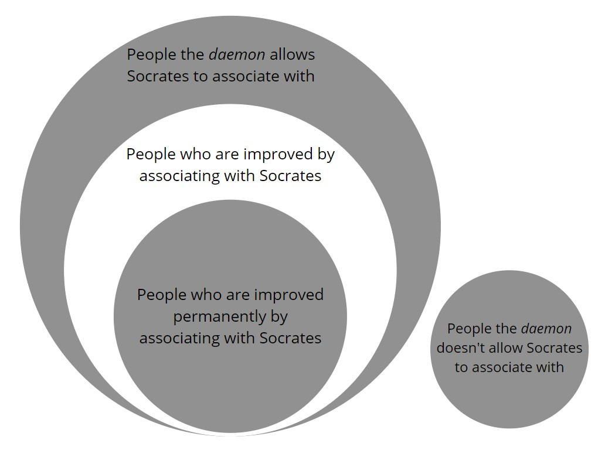

*Theages* is one of Plato's less talked-about dialogues, short and sweet and not near the level of popularity of the big ones such as *Republic*, *Symposium*, and *Apology*. In fact, there is consensus among Plato scholars that *Theages* wasn't actually written by Plato at all (according to a note in the table of contents of Hackett Publishing Company's 1997 edition of [*Plato: Complete Works*](https://www.amazon.com/Plato-Complete-Works/dp/0872203492)). I don't really care about the opinions of a bunch of academics though, and regardless of all that I found *Theages* to be an interesting dialogue, specifically on the subjects of teaching and learning.

One topic that keeps popping up in my [Online Great Books](https://onlinegreatbooks.com/) seminar is the idea that some people just have certain inclinations and interests that other people don't have, and we can't really explain why. For example, those of us in the seminar have all decided for some reason that Plato is worth reading and discussing. We might be able to point to some ideas as to what those reasons are, but I think if we kept working our way back and asking why and how those reasons happened we would eventually get to something we can't exactly explain. For example, I first found Online Great Books through the [Art of Manliness Podcast](https://www.artofmanliness.com/podcast/) and I could point to that as the reason I got started. But even so, it was probably about a year between the time I first listened to that podcast episode and the time I actually joined OGB. Besides, probably thousands of people have also listened to that podcast episode and not joined OGB, and I've also heard about lots of things on podcasts that I didn't end up joining or having any part in. So there must be some other reason besides that one.

If we keep investigating reasons like that, we'll get to something we just can't explain. At some point I'll end up throwing my hands up and saying I was just interested in philosophy, literature, and the Western canon for some reason, but I don't exactly know where that interest came from or why I have it. Other people just don't have that interest, and they'll likely be as clueless about why they *don't* have it as I am about why I *do* have it. This goes for any interest too, not just philosophy. We could be talking about sports, politics, science, tiddlywinks, or underwater basket weaving. Some people just have the interest and some don't. Those who have a level of interest sufficient to spur them on will investigate the thing and probably learn something. Those who don't have the interest just won't pursue the thing and therefore won't learn about the thing.

In *Theages*, a man named Demodocus brings his son Theages to Socrates with a problem. Theages wants to become wise and wants his father to send him to learn from someone who can make him wise, and is frustrated that Demodocus hasn't found anyone yet. Through his usual style of asking questions, Socrates first ascertains what kind of wisdom Theages wants, which is the wisdom to rule a city. Socrates guides Theages into figuring out that in order to acquire the wisdom to rule, he must of course learn from those who are good at ruling. After all, if a man wants to become a great wrestler he goes to those who are good at wrestling to learn; if he wants to become a great carpenter he goes to those who are good at carpentry; likewise for politics and ruling cities.

This doesn't satisfy Theages, however, since he's familiar with Socrates and his arguments and knows that Socrates doesn't exactly think highly of politicians:

> I've heard, Socrates, about the arguments they say you offer, that the sons of the politicians are no better than the sons of the shoemakers. And I believe that what you say is really true, from what I've been able to see. So I'd be foolish if I thought that one of these men would give his wisdom to me, but wouldn't be of any help to his own son, if indeed he could have been helpful to anyone else at all in these matters.

— *Theages* 126d

This calls to mind arguments Socrates makes about the teachability of virtue and the nature of knowledge in *Protagoras* and *Meno*. If those who are wise in matters of ruling can't impart their wisdom to their own sons, how can they impart it to Theages? This also brings up the question of the actual worthiness (or lack thereof) of a political career in the first place, but that's a topic for another discussion.

Socrates then points out a contradiction in Theages' thinking:

> Well, then, my dear sir, how would *you* deal with it, if, when you came to have a son, he pestered you like this, and said that he wanted to become a good painter, and criticized you, his father, for refusing to spend money on him for this, and yet he didn't respect those who practiced this very thing, the painters, and refused to learn from them? Or the flute-players, if he wanted to become a flute-player, or they lyre-players? Would you know what to do with him and where else to send him, if he refused to learn from them?

— *Theages* 126d-e

Theages answers that no, he wouldn't know what to do, to which Socrates responds:

> So now, when you yourself are acting like this with your father, how can you be surprised and criticize him if he's at a loss as to what to do with you and where to send you?

— *Theages* 127a

Theages doesn't exactly answer this question, but instead suggests that he associate with and learn from Socrates himself. Demodocus instantly jumps all over this idea, which I can't help but think is really his covert reason for bringing Theages to Socrates in the first place. Socrates, of course, is not a politician and does not want to be, and he points this out saying that he is not the one who can give Theages the wisdom to rule over a city; he is not the wrestling trainer who can make a great wrestler out of Theages, so to speak.

Theages and his father are undeterred, however. It seems Theages has noticed that people who spend time around Socrates seem to just become "better" somehow:

> You see, father? I really don't think that Socrates is actually willing to associate with me, and yet I'd be prepared to if he were willing. But he's only playing games with us. I know some people my age, and some a little older, who were nothing before they associated with him, but after associating even for a very short time with him became obviously better than all of those they had been worse than before.

— *Theages* 128b-c

Exactly what Theages means by "better" isn't clear, but he is definitely certain that if he spends time with Socrates he will be improved in some way. Socrates has an explanation for this.

Socrates tells Theages about his *daemon*, the spirit that lives inside his head and always warns him if he's about to do something bad. The *daemon* never tells Socrates what he *should* do, but only what he *shoudn't* do. Socrates has learned to never disobey his *daemon*, because he's seen the consequences suffered by others of not heeding what the *daemon* says.

Further, Socrates says that the *daemon* sometimes warns him against taking on particular students:

> I've told you all these things because this spiritual thing has absolute power in my dealings with those who associate with me. On the one hand, it opposes many, and it's impossible for them to be helped by associating with me, so I can't associate with them. On the other hand, it does not prevent my associating with many others, but it is of no help to them. Those whose association with me the power of the spiritual thing assists, however—these are the ones you've noticed, for they make rapid progress right away. And of these, again, who make progress, some are helped in a secure and permanent way, whereas many make wonderful progress as long as they're with me, but when they go away from me they're again no different from anyone else.

— *Theages* 129e-130a

The Venn diagram for people who want to associate with Socrates seems to look something like this:

Socrates himself is unable to predict which circle a given student will fall into; only the *daemon* seems to know whether a given student will be improved through Socrates' association or not. Socrates tells Theages at the end of his explanation:

> So this is how it is when you associate with me, Theages. If it's favored by the god, you'll make great and rapid progress; if not, you won't. So think about it; wouldn't it be safer for you to become educated in the company of somebody who has control over the way he benefits people rather than taking your chances with me?

— *Theages* 130e

Theages, still eager to learn from Socrates, responds thus:

> It seems to me, Socrates, that we should do this: let's test this spiritual thing by associating with one another. If it allows us, then that's what's best; if not, then we'll immediately think about what we should do—whether to go and associate with someone else, ***or try to appease the divine thing that comes to you with prayers and sacrifices and any other way the diviners might suggest***.

— *Theages* 131a (emphasis added by me)

The ending of the dialogue is a little unclear, but it ends either with Socrates agreeing to take Theages on as an associate, or with Socrates agreeing to check with the *daemon* about taking Theages on.

I emphasised the last clause of that last quote for a reason, and we'll come back to it later. First we need to discuss what's going on with this *daemon* and its decisions about Socrates' would-be associates. How does the *daemon* decide which people it will allow Socrates to associate with and which people it won't? Also, what determines which people out of those who are allowed to associate with Socrates will be improved by the association?

Socrates himself is the constant across all his meetings with people, so it follows that the determining factors, whatever they are, must be in the other people. I can't prove this, but I think possibly that the associates the *daemon* allows Socrates to take on just have some not-quite-definable "it" that the other people don't have: some character trait or receptivity to the learning-by-demonstration method of non-teaching that Socrates uses. Those the *daemon* accepts have as their root reason for coming to Socrates a genuine interest or curiosity about improving themselves and are capable of doing so, while those the *daemon* rejects may have some other ulterior motive that may be conscious or not, or maybe the *daemon* simply knows they are incapable of learning by Socrates' methods.

It is important that as far as Socrates is concerned, the *daemon* is the one doing the accepting or rejecting rather than Socrates himself. The *daemon* as Socrates tells it is something divine and inexplicable, something which is able to see into the hearts of men and tell their true motives regardless of what they say. *Socrates* can't see into the hearts of men, and *Socrates* doesn't decide who is or isn't capable of learning from him. He is humble enough to know that he is a mere man and can't possibly know these things; he simply listens to the *daemon* and abides by its instructions.

Now we come back to my first couple of paragraphs about those who have certain inclinations and those who don't, and I think this is something akin to what the *daemon* is looking for in people who want to associate with Socrates. Specifically in the case of OGB, there is no OGB *daemon* that disallows certain people from joining, but the rejection process takes care of itself. Those who aren't interested in or receptive to the style of learning we do at OGB simply don't join in the first place, or if they do join are quickly turned off when they find out it's not the environment they're looking for and drop out. Again there seems to be some kind of not-quite-definable "it" that some people have which makes them a good fit, and that others just don't have. No intervention by any authority, or even any "cOmMuNiTy PoLiCiNg", is necessary or desirable, as it isn't up to any other person or people to determine whether Person A has "it" or not.

Now let's return to Socrates' above quote from 130e about how it would be a safer bet for Theages to learn from "somebody who has control over the way he benefits people", of course implying that Socrates doesn't have control over the way he benefits people. If Socrates doesn't control who gains benefit by associating with him, who or what does? What is the determining factor? Although again I can't exactly prove this, my hypothesis is that the associate himself determines whether he benefits or not.

We know from Socrates' statements that a person's being accepted by the *daemon* is no guarantee that he'll actually be improved by his association with Socrates. Once the *daemon* accepts an associate, we know that he is capable of learning from Socrates; if he wasn't capable then the *daemon* wouldn't have accepted him. But mere capability doesn't determine what *will* happen. I'm perfectly capable of hopping in my Jeep and driving 12 hours to Albuquerque right now, but I'm not going to do that. People are *capable* of doing all kinds of things that they don't actually do. Just because a man is *capable* of learning from Socrates doesn't mean he *will* learn from Socrates; once accepted by the *daemon* it is up to him to actually do the learning.

When Socrates walks Meno's slave boy through the demonstration of the areas of squares in *Meno*, he makes it a point to say that he didn't *teach* the slave boy anything. All he did was ask the right questions, and the slave boy was able to come up with correct answers to every question along the way, eventually assembling them into a new piece of knowledge about squares and their areas that he didn't have before. Socrates' concept of teaching is not the handing out of information to students, but the asking of questions to spur on the student's own recollection of information. This style of teaching, of course, requires the student to be interested in the subject. If the student has no interest in learning what the teacher is showing him, he just won't answer the questions and won't learn or recollect anything. The teacher can't force it and it's not up to him whether the student is interested in the subject or not, hence Socrates' lack of control over who actually learns from him and who doesn't.

Which circle of the Venn diagram the student falls into depends entirely on his own inclinations, interests, and capabilities. If the *daemon* determines a would-be student isn't capable of learning from Socrates, he will fall into the right-hand circle and Socrates won't associate with him at all. Once accepted by the *daemon*, a student falls into the left-hand circle and it is then up to him to learn for himself, using Socrates' questions as stepping stones. Different levels of dedication to learning determine which level of the larger left-hand circle a student ends up in.

This is also borne out in our example about OGB. For each person who decides to read and discuss the Great Books, different levels of capability, interest, and dedication to reading and discussion will lead to different effects on that person's intellect, character, and whatever else. Capability and interest are probably not up to any conscious decision on the part of the individual. As we discussed above, it's incredibly hard and maybe impossible to explain where a particular interest came from or why we have it. Dedication to the task, however, *is* an individual decision. I could have all the capability and interest in the world, but if I keep distracting myself with the latest bingeable Netflix series to the point where I'm not spending any time with Plato, I'm not going to learn whatever Plato has to teach me.

With all this in mind, does Theages have "it", whatever "it" is? I realize it's a little bit contradictory for me to ask this question since I just said above that it's not up to anyone else to determine whether a particular person has "it" or not, but I think it will be useful to look at a couple of indicators.

While investigating what Theages actually wants, Socrates asks:

> Tell us, then, Theages, do you say you want to become wise; are you demanding that your father here arrange to have you associate with some man who'll make you wise?

— *Theages* 122e

Theages answers in the affirmative, and I find the phrasing here fairly telling. Theages wants to associate with "some man who'll make [him] wise". As we've already seen, though, Socrates isn't going to "make" anyone into anything. It's up to the student to do the learning, not the teacher to "make" the student into anything. A wise teacher like Socrates knows that he doesn't actually have control over what a conscious, independent individual becomes or doesn't become. Judging by the phrasing here, Theages seems not to understand this and is looking to simply drink wisdom from a teacher like water from a glass.

On the other hand, Theages does seem open to experimentation. At 131a he suggests testing the *daemon* to see if it allows Socrates to take him on, and there is nothing about the *daemon* rejecting Theages in this dialogue. Theages suggests seeing what the *daemon* says, and also suggests supplicating the *daemon* with prayer and sacrifice if it rejects him. If my analysis is correct, then Theages misses the point by suggesting appeasement of the *daemon*. In my view, the *daemon* simply assesses the character and capabilities of the student himself and makes its decision accordingly. If this is true it wouldn't change its mind due to prayer or sacrifices, because prayer and sacrifice wouldn't change the contents of the would-be associate's mind and soul on which the *daemon*'s decision was based. I think this suggestion on Theages' part indicates that he doesn't understand what the *daemon* is actually doing; it's not making an arbitrary decision, or even a reward- or punishment-based decision. It's simply assessing whether Theages is capable of benefitting from the association.

This all comes back to some "it" that the *daemon* apparently sees in some people but not in others. It doesn't reject Theages in the dialogue, and may have actually already accepted him depending on how you interpret the ending, which indicates that Theages has some amount of "it" and is at least capable of learning from Socrates. Whether he will actually learn anything remains to be seen and is not explored in this dialogue.

I wonder the same about myself sometimes. I've apparently been accepted by the philosophy *daemon* of OGB since I've been a member for a year now and I'm still here and still working my way through Plato, so I'm pretty sure I have the capability of learning a lot. But how much, and what effects it will have on my life in the future, remains to be seen. I find myself wondering what "it" is that makes one person interested in or capable of something and another not, and now I've written a whole blog post trying to organize my thoughts about it and I'm really no closer to having an answer than before. Although I do understand now that Socrates isn't just going to give me one, for this or for anything else.
